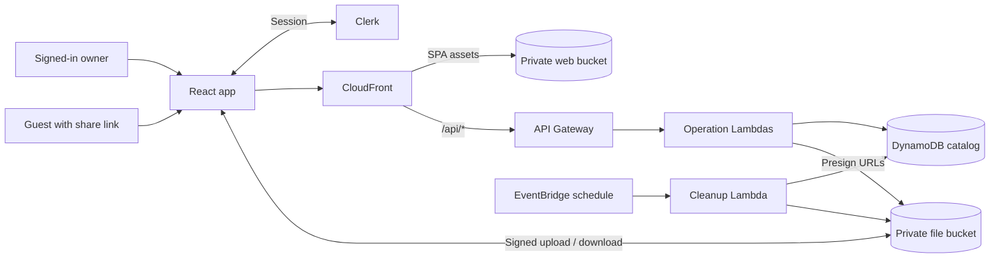

<div align="center">
  

  <h1>luja Cloud</h1>

  <p><strong>Place for my files</strong></p>
  <p>Upload, download, store and share files.</p>

  <p>
    
    
    
    
  </p>

  <p>
    <a href="docs/architecture.md">Architecture</a> ·
    <a href="infra/README.md">Deployment</a> ·
    <a href="#tech-stack">Tech stack</a> ·
    <a href="#quick-start">Quick start</a>
  </p>
</div>

---

## Architecture



Read the [architecture doc](docs/architecture.md) for more details.

## Tech stack

| Layer | Technology |
| --- | --- |
| **Frontend** | React 19, TypeScript, Vite, Tailwind CSS, shadcn/ui |
| **Client data** | TanStack Router, Query, and Table |
| **Authentication** | Clerk |
| **API** | Amazon API Gateway and Node.js Lambda |
| **Storage** | Amazon S3 and DynamoDB |
| **Delivery** | Amazon CloudFront |
| **Infrastructure** | AWS CDK |

## Quick start

### Prerequisites

- Node.js 22.12 or newer
- npm
- AWS CLI credentials
- A Clerk application

### 1. Install

```bash
git clone https://github.com/luojam/luja-cloud.git
cd luja-cloud
npm --prefix frontend ci
npm --prefix infra ci
```

### 2. Configure

```bash
cp frontend/.env.example frontend/.env
cp infra/.env.example infra/.env
```

Add your Clerk publishable key to `frontend/.env` and your exact Clerk issuer URL to `infra/.env`. Clerk session tokens must include the `luja-cloud-api` audience.

### 3. Deploy

Make sure you have bootstrapped CDK before attempting to deploy.

```bash
cd infra
npm run diff
npm run deploy
```

The stack outputs an `ApplicationUrl` for the deployed app. For complete Clerk setup, custom domains, smoke testing, monitoring, troubleshooting, and teardown, follow the [deployment runbook](infra/README.md).

<details>
<summary><strong>Run the frontend locally</strong></summary>

Set `API_PROXY_TARGET` in `frontend/.env` to a deployed API Gateway or CloudFront origin, then run:

```bash
npm --prefix frontend run dev
```

Vite proxies local `/api/*` requests to that backend. See the [frontend guide](frontend/README.md) for details.

</details>

## Repository layout

```text
luja-cloud/
├── frontend/   React + TypeScript application
├── infra/      AWS CDK stack, Lambda handlers, and tests
├── docs/       Architecture and project documentation
└── README.md   Project overview
```

## Development checks

```bash
# Frontend
npm --prefix frontend run typecheck
npm --prefix frontend run check
npm --prefix frontend run format:check
npm --prefix frontend run build

# Infrastructure and backend
npm --prefix infra test
npm --prefix infra run build
```

> [!IMPORTANT]
> Destroying the CDK stack permanently deletes stack-owned buckets and files, DynamoDB metadata, APIs, Lambdas, and dedicated application logs. Review the [destroy instructions](infra/README.md#destroy) first.
