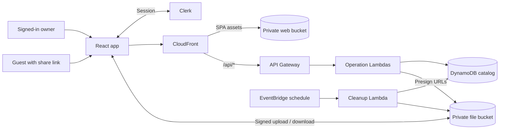

<div align="center">
  

  <h1>luja Cloud</h1>

  <p><strong>A private, self-hosted file vault.</strong></p>
  <p>Upload files from one device, retrieve them from another, and share them with secure, revocable links.</p>

  <p>
    
    
    
    
  </p>

  <p>
    <a href="#features">Features</a> ·
    <a href="#architecture">Architecture</a> ·
    <a href="#quick-start">Quick start</a> ·
    <a href="docs/architecture.md">Documentation</a> ·
    <a href="infra/README.md">Deployment</a>
  </p>
</div>

---

## Features

| | |
| --- | --- |
| 🔒 **Private by default** | Every user gets an isolated file catalog backed by private S3 storage. |
| ⚡ **Direct transfers** | The browser uploads to and downloads from S3 with short-lived presigned URLs. |
| 🔗 **Revocable sharing** | Create unguessable guest links without making files public, then revoke them at any time. |
| 🗂️ **Simple file management** | Upload, sort, rename, download, share, and delete files from a responsive dashboard. |
| ☁️ **Serverless infrastructure** | CloudFront, API Gateway, Lambda, DynamoDB, and S3 keep maintenance and idle costs low. |
| 🧹 **Automatic cleanup** | A scheduled job removes abandoned uploads and retries interrupted deletions. |

## Architecture

luja Cloud is a React single-page app backed by focused serverless operations. File bytes travel directly between the browser and S3—they never pass through API Gateway or Lambda.



### Security model

- Clerk JWTs protect every owner route; public access is limited to share resolution and download routes.
- Ownership comes from the verified JWT subject, never from client-supplied data.
- Buckets block public access and use S3-managed encryption.
- Share tokens contain 256 bits of randomness; only their SHA-256 hashes are stored.
- Upload and download URLs expire after five minutes.
- Files remain private when shared—the link is a revocable bearer credential, not an S3 public URL.

Read the [architecture guide](docs/architecture.md) for API routes, storage design, file flows, cleanup behavior, and current limitations.

## Tech stack

| Layer | Technology |
| --- | --- |
| **Frontend** | React 19, TypeScript, Vite, Tailwind CSS, shadcn/ui |
| **Client data** | TanStack Router, Query, and Table |
| **Authentication** | Clerk |
| **API** | Amazon API Gateway and Node.js Lambda |
| **Storage** | Amazon S3 and DynamoDB |
| **Delivery** | Amazon CloudFront |
| **Infrastructure** | AWS CDK |

## Quick start

### Prerequisites

- Node.js 22.12 or newer
- npm
- AWS CLI credentials
- A Clerk application

### 1. Install

```bash
git clone https://github.com/luojam/luja-cloud.git
cd luja-cloud
npm --prefix frontend ci
npm --prefix infra ci
```

### 2. Configure

```bash
cp frontend/.env.example frontend/.env
cp infra/.env.example infra/.env
```

Add your Clerk publishable key to `frontend/.env` and your exact Clerk issuer URL to `infra/.env`. Clerk session tokens must include the `luja-cloud-api` audience.

### 3. Deploy

From `infra/`, select your AWS profile and region, bootstrap CDK if needed, review the changes, and deploy:

```bash
cd infra
export AWS_PROFILE=<profile>
export AWS_REGION=<region>

aws sts get-caller-identity
npx cdk bootstrap "aws://$(aws sts get-caller-identity --query Account --output text)/$AWS_REGION"
npm run diff
npm run deploy
```

The stack outputs an `ApplicationUrl` for the deployed app. For complete Clerk setup, custom domains, smoke testing, monitoring, troubleshooting, and teardown, follow the [deployment runbook](infra/README.md).

<details>
<summary><strong>Run the frontend locally</strong></summary>

Set `API_PROXY_TARGET` in `frontend/.env` to a deployed API Gateway or CloudFront origin, then run:

```bash
npm --prefix frontend run dev
```

Vite proxies local `/api/*` requests to that backend. See the [frontend guide](frontend/README.md) for details.

</details>

## Repository layout

```text
luja-cloud/
├── frontend/   React + TypeScript application
├── infra/      AWS CDK stack, Lambda handlers, and tests
├── docs/       Architecture and project documentation
└── README.md   Project overview
```

## Development checks

```bash
# Frontend
npm --prefix frontend run typecheck
npm --prefix frontend run check
npm --prefix frontend run format:check
npm --prefix frontend run build

# Infrastructure and backend
npm --prefix infra test
npm --prefix infra run build
```

> [!IMPORTANT]
> Destroying the CDK stack permanently deletes stack-owned buckets and files, DynamoDB metadata, APIs, Lambdas, and dedicated application logs. Review the [destroy instructions](infra/README.md#destroy) first.
