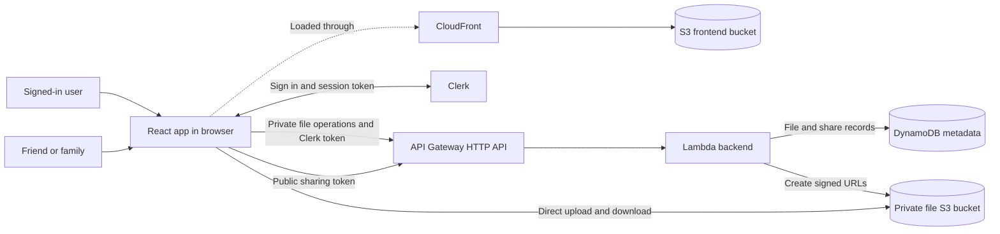
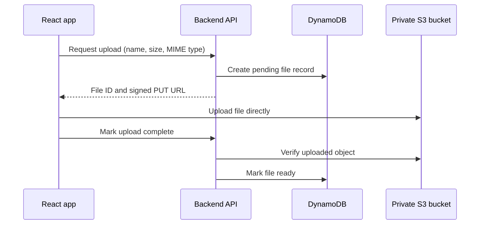
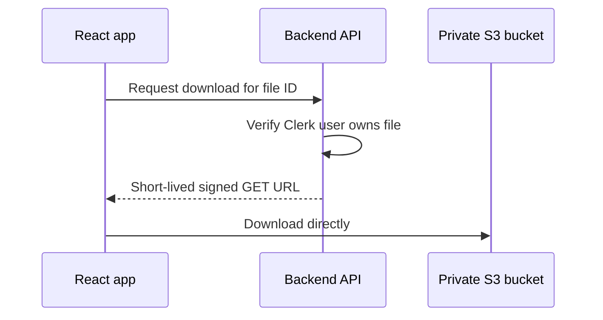
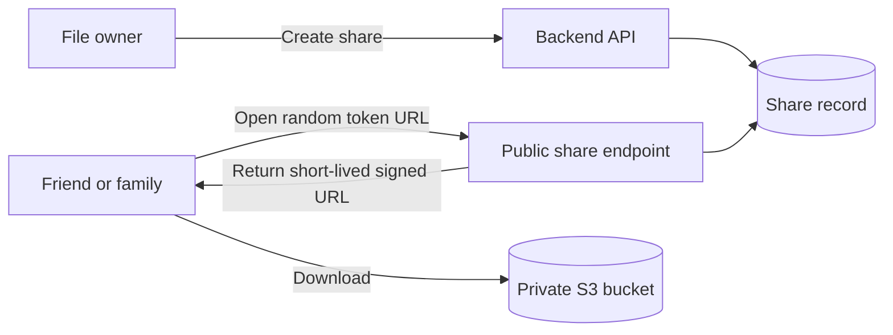
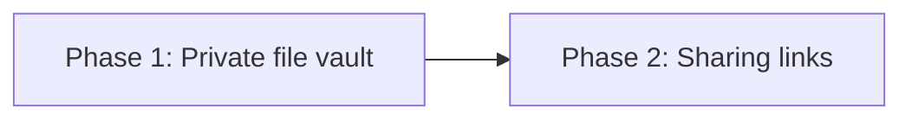

# Luja Cloud Architecture

## Goal

Luja Cloud is a small, personal file vault for transferring files between computers and sharing selected files with family and friends.

The initial product shape is:

- Each signed-in user owns a private collection of files.
- Files are private by default.
- A user can create and revoke an unguessable sharing link for a file.
- The system favors low maintenance and low idle cost over commercial-scale complexity.

## Proposed architecture



### AWS components

| Component | Responsibility |
| --- | --- |
| S3 and CloudFront | Host and deliver the built React application. |
| Clerk | User authentication; the backend validates Clerk session tokens. |
| API Gateway HTTP API | Exposes the small backend API. |
| Lambda | Authorizes requests, manages metadata, and creates short-lived S3 URLs. |
| S3 | Stores private file contents. Public access remains blocked. |
| DynamoDB | Stores filenames, ownership, timestamps, upload state, and sharing records. |

The CDK application in `infra/` will define and deploy both the frontend hosting and backend resources. The frontend assets and user files use separate S3 buckets with separate access policies.

## Storage model

S3 object keys should use generated IDs instead of user-provided filenames:

```text
files/{fileId}
```

The visible filename and other properties live in DynamoDB. This allows even a very large file to be renamed without copying its S3 object.

A file record will conceptually contain:

```text
fileId
ownerId            Clerk user ID
name
mimeType
sizeBytes
objectKey
status              pending | ready
createdAt
modifiedAt
```

The exact DynamoDB key design can be selected during implementation.

## API route convention

All browser-facing backend routes use the `/api/*` namespace. CloudFront routes that namespace to API Gateway while serving the React application for other paths. The browser uses same-origin API paths in both local and deployed environments.

## Private file operations

The first backend API should support:

```text
GET    /api/files
POST   /api/files/uploads
POST   /api/files/{id}/complete
GET    /api/files/{id}/download
PATCH  /api/files/{id}
DELETE /api/files/{id}
```

Every private operation checks that the authenticated Clerk user owns the requested file.

## Upload flow

File bytes go directly from the browser to S3. They do not pass through API Gateway or Lambda.



Uploads use one signed PUT request per file. Multipart uploads are intentionally out of scope.

## Download flow



The S3 bucket is never made public.

## Sharing links

A signed-in owner can create an unguessable link for one file. Opening that link does not require a Clerk account.



A share record will conceptually contain:

```text
shareTokenHash
fileId
ownerId
createdAt
revokedAt           optional
```

Only a hash of the share token should be stored. The raw, long random token appears in the URL and acts as the guest's permission to access the file. Resolving a valid share returns a short-lived S3 download URL.

Initial sharing behavior:

- The owner toggles sharing on or off for each file.
- Turning sharing on creates a link that does not expire automatically.
- Turning sharing off immediately invalidates the link.
- If sharing is enabled again later, a new token is generated so the revoked link remains invalid.
- The S3 object always remains private, even when link sharing is enabled.
- A deleted file invalidates its sharing link.

## Delivery phases



### Phase 1: private file vault

- React application hosted with S3 and CloudFront
- Clerk-authenticated backend
- List, upload, download, rename, and delete
- Private encrypted S3 bucket
- DynamoDB metadata
- Short-lived signed S3 URLs
- A 100 MB maximum size per file, enforced before issuing an upload URL
- CORS restrictions
- Cleanup of abandoned uploads
- Pay-per-request DynamoDB billing

### Phase 2: sharing links

- Create and revoke a file share
- Optional expiry
- Public share route in the React application
- Public API endpoint that exchanges a valid token for a short-lived download URL

## Explicitly out of scope initially

- Public S3 objects
- Cognito alongside Clerk
- Containers or continuously running servers
- Search infrastructure
- Complex organization roles
- Commercial-scale analytics or billing

## Confirmed decisions

- The maximum file size is 100 MB per file for the first release.
- Deletion is immediate and permanent after a clear confirmation dialog. It removes the S3 object, metadata, and associated sharing links without a recovery period.
- Sharing is manually toggled per file. Sharing links do not expire automatically and remain valid until the owner disables sharing or deletes the file.
- Each file can have at most one active sharing link.
- The CDK stack deploys the React application using a dedicated S3 bucket and CloudFront distribution alongside the backend.
- During the current development stage, all stack-owned resources use destructive removal policies. Buckets are emptied automatically so destroying the stack also deletes stored objects and metadata.

There are no outstanding decisions from the initial architecture outline.
