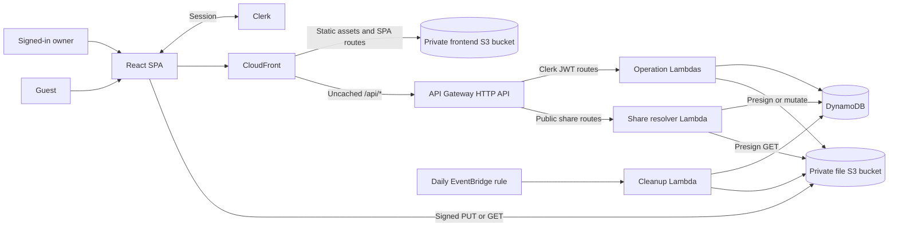

# Luja Cloud Architecture

## Scope

Luja Cloud is an implemented personal file vault for moving files between computers and sharing selected files. Each Clerk user owns a private catalog; files stay private unless the owner creates an unguessable guest link. The design favors low maintenance and low idle cost over large-scale features.

## System layout



A single CDK stack in `infra/` defines the application. CloudFront reads the frontend bucket through Origin Access Control, serves extensionless SPA routes from `index.html`, and forwards `/api/*` to API Gateway with caching disabled. Requests whose final path segment has a file extension are not rewritten. The generated API Gateway endpoint also remains reachable directly.

Backend operations use focused Node.js Lambdas with operation-specific IAM permissions. DynamoDB stores metadata; file bytes never pass through API Gateway or Lambda.

## Frontend

`frontend/` is a React and TypeScript Vite SPA. TanStack Router provides file-based routes, React Query owns server state, React Table powers the file list, and Clerk supplies browser authentication. API modules under `src/lib/` validate response shapes before data enters the UI.

The main routes are:

- `/` redirects to `/sign-in`; `/sign-in` and `/sign-up` redirect active users to `/dashboard`.
- `/dashboard` requires a loaded Clerk session and a successful `GET /api/session` check before protected content renders.
- `/share/$token` is public and renders without waiting for Clerk session restoration.

Owner requests obtain a Clerk token per operation and use same-origin `/api/*` paths. Public share requests omit authorization. Vite proxies those same paths during local development.

## API and authorization

API Gateway validates protected-route JWTs against the configured Clerk issuer and the `luja-cloud-api` audience. Lambdas derive ownership only from the verified `sub` claim; clients cannot select an owner.

| Route | Purpose |
| --- | --- |
| `GET /api/session` | Verify the Clerk-to-backend session. |
| `GET /api/files` | List the owner's ready files. |
| `POST /api/files/uploads` | Create pending metadata and a signed upload URL. |
| `POST /api/files/{id}/complete` | Verify the object and mark it ready. |
| `GET /api/files/{id}/download` | Create an owner download URL. |
| `PATCH /api/files/{id}` | Rename visible metadata. |
| `DELETE /api/files/{id}` | Permanently delete a file. |
| `POST /api/files/{id}/share` | Create the file's guest link. |
| `DELETE /api/files/{id}/share` | Revoke the guest link. |
| `GET /api/shares/{token}` | Return public file metadata. |
| `POST /api/shares/{token}/download` | Exchange a valid guest token for a download URL. |

Only the two `/api/shares/*` routes are public. API Gateway throttles each at 10 requests per second with a burst of 20. File and share responses disable caching.

## Storage model

S3 keys use generated IDs rather than filenames:

```text
files/{fileId}
```

DynamoDB items contain:

```text
ownerId        partition key; Clerk user ID
fileId         sort key
name
mimeType
sizeBytes
objectKey
status         pending | ready | cleanup | deleting
createdAt
modifiedAt
tokenHash?     SHA-256 digest for an active guest link
```

The table uses on-demand billing. `TokenHashIndex` is a sparse, keys-only global secondary index partitioned by `tokenHash`; private files are absent from it. Only `ready` records are exposed. Renaming changes metadata without copying the S3 object.

## File flows

### Upload

1. The API validates metadata, including the 100 MiB (104,857,600-byte) limit, creates a `pending` item, and returns a five-minute signed PUT URL bound to the declared size.
2. The browser uploads directly to S3.
3. The completion route checks that the object exists with the exact size, then conditionally changes `pending` to `ready`.

Uploads use one PUT per file; multipart upload is not implemented. The file bucket's CORS policy permits only PUT requests from local Vite and deployed application origins.

### Download

Owner and guest download routes revalidate access before returning a five-minute signed S3 GET URL with a sanitized attachment filename. The browser then downloads directly from S3. The bucket never permits public reads.

### Sharing and deletion

- Enabling sharing generates 256 random bits encoded as unpadded base64url. The server stores only its SHA-256 hash; the raw bearer token is returned once and then exists in the share URL and transient UI state.
- A file has at most one active link and links do not expire automatically. Concurrent or repeated enable attempts are serialized by a conditional update; an already shared file returns `409`.
- Public resolution hashes the token, queries `TokenHashIndex`, then strongly rereads the base item and requires the same hash and `ready` state. Malformed, unknown, revoked, deleted, and stale links all return the same `404`.
- Revocation removes `tokenHash`. Deletion atomically changes `ready` to `deleting` and removes the hash before deleting the S3 object and metadata. Retries and scheduled cleanup finish partial deletions.

A request validated concurrently with revocation can still finish signing, and an issued URL may remain usable for up to five minutes.

## Cleanup and operational posture

An EventBridge rule invokes cleanup daily. It scans the small personal-scale table for `pending` uploads at least 24 hours old plus retryable `cleanup` and `deleting` records. Conditional state changes prevent cleanup from deleting an upload that completed first.

Both S3 buckets block public access and use S3-managed encryption. Dedicated application Lambda and API access log groups retain one week; configured log formats and handlers omit raw paths, tokens, headers, records, object keys, and signed URLs. The file table, buckets, and dedicated logs use destructive removal policies, and the buckets are emptied automatically.

Current limitations are deliberate: there is no multipart upload, malware scanning, per-user aggregate quota, S3 versioning, DynamoDB point-in-time recovery, or WAF. A PUT started before URL expiry can theoretically finish after abandoned-upload cleanup and leave an unreferenced object. See `infra/README.md` for configuration, deployment, monitoring, and recovery procedures.
