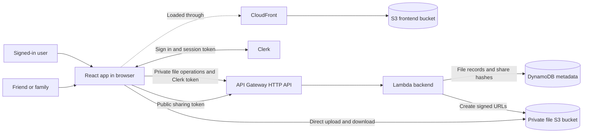
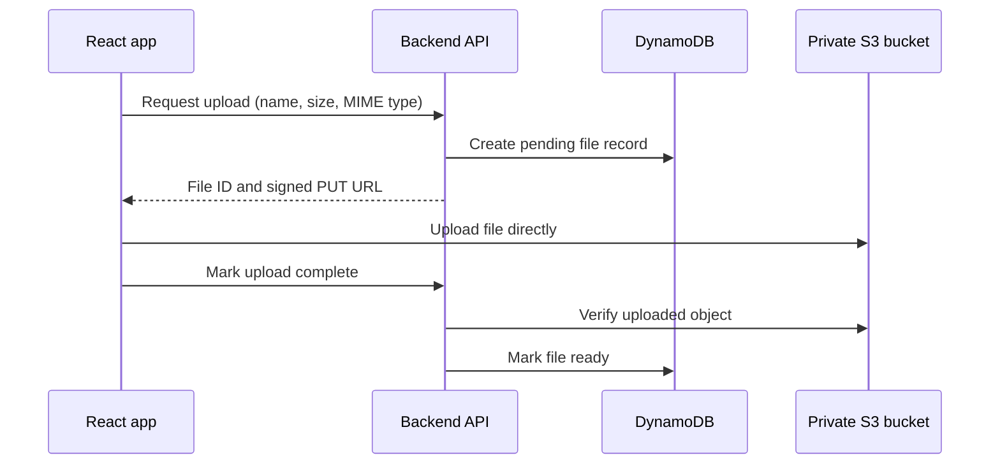
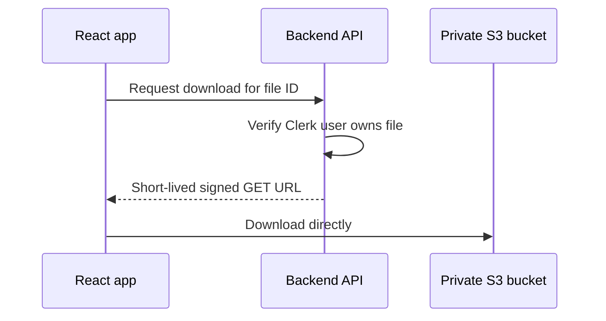
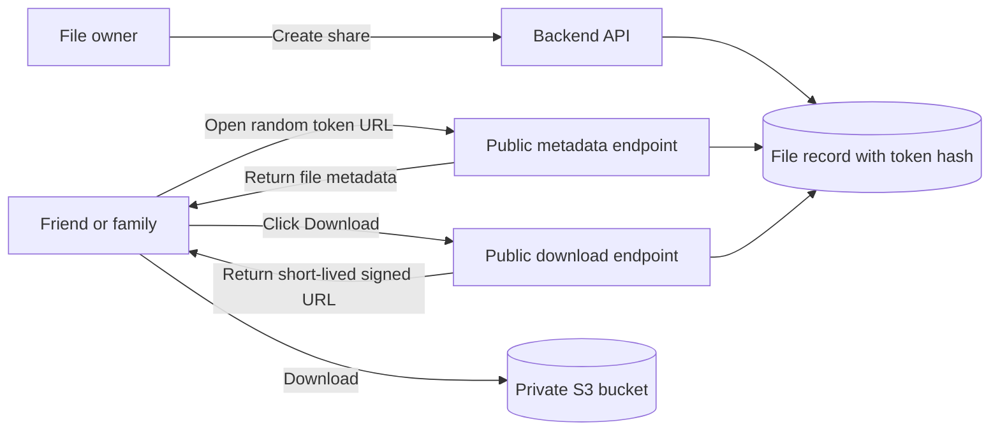
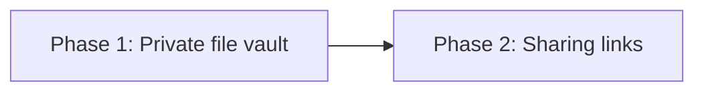

# Luja Cloud Architecture

## Goal

Luja Cloud is a small, personal file vault for transferring files between computers and sharing selected files with family and friends.

The initial product shape is:

- Each signed-in user owns a private collection of files.
- Files are private by default.
- A user can create and revoke an unguessable sharing link for a file.
- The system favors low maintenance and low idle cost over commercial-scale complexity.

## Proposed architecture



### AWS components

| Component            | Responsibility                                                           |
| -------------------- | ------------------------------------------------------------------------ |
| S3 and CloudFront    | Host and deliver the built React application.                            |
| Clerk                | User authentication; the backend validates Clerk session tokens.         |
| API Gateway HTTP API | Exposes the small backend API.                                           |
| Lambda               | Authorizes requests, manages metadata, and creates short-lived S3 URLs.  |
| S3                   | Stores private file contents. Public access remains blocked.             |
| DynamoDB             | Stores filenames, ownership, timestamps, upload state, and share hashes. |

The CDK application in `infra/` will define and deploy both the frontend hosting and backend resources. The frontend assets and user files use separate S3 buckets with separate access policies.

## Storage model

S3 object keys should use generated IDs instead of user-provided filenames:

```text
files/{fileId}
```

The visible filename and other properties live in DynamoDB. This allows even a very large file to be renamed without copying its S3 object.

A file record will conceptually contain:

```text
fileId
ownerId            Clerk user ID
name
mimeType
sizeBytes
objectKey
status              pending | ready | cleanup | deleting (internal states not public)
createdAt
modifiedAt
tokenHash?          SHA-256 share-token digest; absent for private files
```

The file table uses `ownerId` as its partition key and `fileId` as its sort key. This makes every private lookup owner-scoped directly from the verified Clerk `sub` claim and supports listing one owner's files without a secondary index. It uses on-demand billing and destructive removal during the current development stage.

## API route convention

All browser-facing backend routes use the `/api/*` namespace. CloudFront routes that namespace to API Gateway while serving the React application for other paths. The browser uses same-origin API paths in both local and deployed environments.

## Private file operations

The first backend API should support:

```text
GET    /api/files
POST   /api/files/uploads
POST   /api/files/{id}/complete
GET    /api/files/{id}/download
PATCH  /api/files/{id}
DELETE /api/files/{id}
```

Every private operation checks that the authenticated Clerk user owns the requested file. Sharing additionally uses authenticated `POST /api/files/{id}/share` and `DELETE /api/files/{id}/share`. Public guests fetch metadata with `GET /api/shares/{token}` and request a download URL with `POST /api/shares/{token}/download`.

## Upload flow

File bytes go directly from the browser to S3. They do not pass through API Gateway or Lambda.



Uploads use one signed PUT request per file. Multipart uploads are intentionally out of scope.

A daily cleanup job treats `pending` records at least 24 hours old as abandoned. It first conditionally moves each candidate to the internal `cleanup` state, then deletes its S3 object and metadata. Completion can only move `pending` to `ready`, so whichever operation claims the record first wins without cleanup deleting a concurrently completed file. `cleanup` records are retried after partial failures and are never exposed through the public API.

## Download flow



The S3 bucket is never made public.

## Sharing links

A signed-in owner can create an unguessable link for one file. Opening that link does not require a Clerk account.



An active link is represented by an optional `tokenHash` attribute directly on its ready file item. `TokenHashIndex` is a keys-only global secondary index on the file table, partitioned by `tokenHash`. Because DynamoDB omits items without the index key, the index is sparse and contains only shared files. A file can hold only one active hash; revocation removes the attribute, and re-enabling stores a newly generated hash.

Tokens contain 256 bits from the platform cryptographic RNG and use unpadded base64url encoding. Only the SHA-256 hash is persisted. The raw token exists only in the enable response and guest URL and acts as the guest's permission. API and Lambda logging never includes raw request paths, tokens, hashes, records, or signed URLs. Opening a valid share returns only public file metadata. Clicking **Download** revalidates the share and returns a five-minute S3 GET URL with a sanitized attachment disposition; S3 itself remains private.

Sharing behavior:

- `POST /api/files/{id}/share` and `DELETE /api/files/{id}/share` are Clerk-authorized owner routes. `GET /api/shares/{token}` and `POST /api/shares/{token}/download` are public routes; both return `cache-control: no-store`. `GET /api/files` reports only an `isShared` boolean, never a token or hash.
- Turning sharing on creates a link that does not expire automatically. A second enable while a record is active returns `409` rather than rotating it because the existing raw token cannot be recovered from its hash.
- Enable conditionally sets `tokenHash` only while the owned file is still `ready` and has no active hash. This single-item update serializes concurrent enable and delete requests and ensures at most one request can return a newly active token.
- Turning sharing off idempotently removes `tokenHash`. Both public operations hash the presented token, query `TokenHashIndex`, then strongly re-read the file item and compare its current hash to reject stale index results. Malformed, unknown, revoked, deleted, non-ready, and inconsistent links all return the same `404`.
- If sharing is enabled again later, a fresh random token and hash are generated, so the revoked link remains invalid.
- Deletion atomically moves a ready file to an internal `deleting` state and removes `tokenHash` before deleting S3 bytes and file metadata. Enable cannot commit after that claim. Request retries and the daily cleanup job finish a partially completed deletion; both list and public resolution reject `deleting` records.
- CloudFront sends `/api/*`, including both public share operations, to API Gateway with caching disabled and forwards the token path. API Gateway applies per-route throttles to the public operations even when its generated endpoint is called directly. `/share/{token}` does not match that behavior and is rewritten to the SPA's `index.html`.
- The S3 object always remains private, even when link sharing is enabled. Page load never issues an S3 URL. Once revocation commits, a download request whose strong validation read occurs afterward cannot issue a URL. A request validated concurrently before revocation may still finish signing, and issued URLs may continue working for up to five minutes.

## Delivery phases



### Phase 1: private file vault

- React application hosted with S3 and CloudFront
- Clerk-authenticated backend
- List, upload, download, rename, and delete
- Private encrypted S3 bucket
- DynamoDB metadata
- Short-lived signed S3 URLs
- A 100 MB maximum size per file, enforced before issuing an upload URL
- CORS restrictions
- Cleanup of abandoned uploads
- Pay-per-request DynamoDB billing

### Phase 2: sharing links

- Create and revoke a file share
- No automatic expiry for the share; five-minute expiry for resolved S3 URLs
- Public share route in the React application
- Public metadata endpoint and an on-request endpoint that exchanges a valid token for a short-lived download URL

## Explicitly out of scope initially

- Public S3 objects
- Cognito alongside Clerk
- Containers or continuously running servers
- Search infrastructure
- Complex organization roles
- Commercial-scale analytics or billing

## Confirmed decisions

- The maximum file size is 100 MB per file for the first release.
- Deletion is immediate and permanent after a clear confirmation dialog. It removes the S3 object, metadata, and associated sharing links without a recovery period.
- Sharing is manually toggled per file. Sharing links do not expire automatically and remain valid until the owner disables sharing or deletes the file.
- Each file can have at most one active sharing link.
- The CDK stack deploys the React application using a dedicated S3 bucket and CloudFront distribution alongside the backend.
- During the current development stage, all stack-owned resources use destructive removal policies. Buckets are emptied automatically so destroying the stack also deletes stored objects and metadata.

There are no outstanding decisions from the initial architecture outline.
